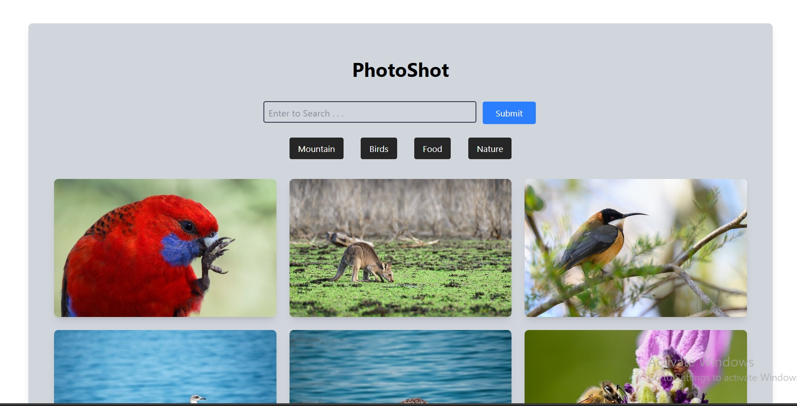

# PhotoShot

PhotoShot is a modern image search application built with **ReactJS**, **TypeScript**, and **TailwindCSS**. Effortlessly search and discover stunning images with a sleek, responsive interface.

## Features

- 🔍 Real-time image search
- ⚡ Fast and responsive UI
- 🎨 Built with React, TypeScript, and TailwindCSS
- 📱 Mobile-friendly design

## Getting Started

Follow these steps to clone and run PhotoShot on your local machine:

### 1. Clone the Repository

```bash
git clone https://github.com/roshan-metrix/PhotoShot.git
```

### 2. Navigate to the Project Directory

```bash
cd PhotoShot
```

### 3. Install Dependencies

```bash
npm install
```

### 4. Start the Development Server

```bash
npm run dev
```

## Technologies Used

- [ReactJS](https://reactjs.org/)
- [TypeScript](https://www.typescriptlang.org/)
- [TailwindCSS](https://tailwindcss.com/)

## Screenshot



## License

This project is licensed under the [MIT License](license.txt).

---

Feel free to contribute or open issues to help improve PhotoShot!
